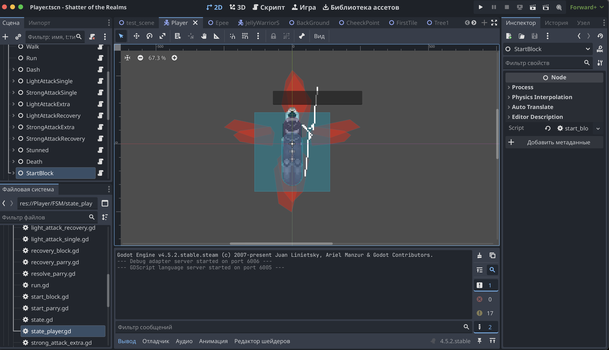
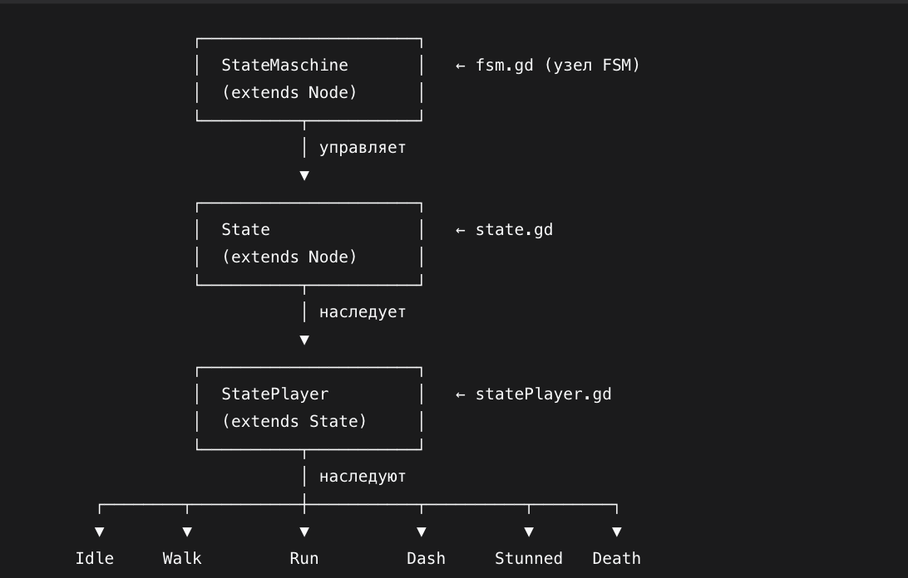
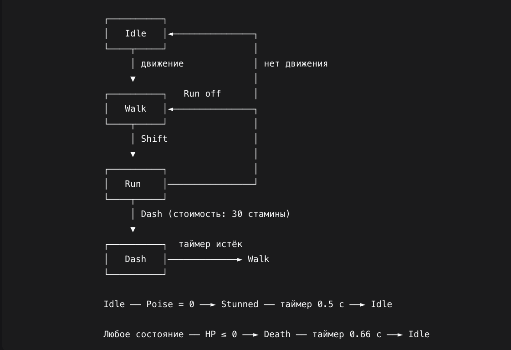

Руководство по FSM для персонажа в Godot 4.5
Дисциплина: Технология по выбору (разработка игр)
Тема: Реализация конечного автомата состояний (FSM) для персонажа в Godot 4.5
Движок: Godot 4.5
Язык: GDScript

1. Введение. Краткий обзор интерфейса Godot 4.5
Прежде чем перейти к конечному автомату, разберёмся с базовыми понятиями движка. Для новичка Godot может показаться перегруженным, но его структура логична и состоит из нескольких ключевых сущностей.

1.1. Сцены и узлы (Scene, Node)
В Godot всё есть узел (Node). Из узлов собираются сцены (Scene) — переиспользуемые блоки: персонаж, враг, уровень, элемент интерфейса.

Сцена — это дерево узлов, которое хранится в отдельном файле .tscn.

У каждого узла есть родитель и, при необходимости, дети.

Узлы могут быть разных типов: Node, Node2D, CharacterBody2D, Timer, Label, AnimatedSprite2D и сотни других.

Для нашего проекта ключевые типы узлов:

|Тип узла	|Роль|
|---|---|
|CharacterBody2D	|Корень персонажа (Player)|
|Node	|Родитель FSM и его состояний|
|AnimatedSprite2D	|Проигрывание анимаций персонажа|
|Timer	|Вспомогательные таймеры (дэш, оглушение, смерть)|
|Label	|Отладочный вывод на экран|

1.2. Основные панели редактора
Scene (Сцена) — слева, дерево узлов текущей сцены.

Inspector (Инспектор) — справа, свойства выбранного узла. Здесь отображаются переменные со @export.

FileSystem (Файловая система) — внизу слева, все файлы проекта.

Script (Редактор скриптов) — центральная вкладка, где пишется GDScript.

Output (Вывод) — внизу, print() и ошибки.

Node (Узлы) — внизу справа, список всех типов узлов для добавления.

1.3. Скрипты и жизненный цикл
Скрипт можно повесить на любой узел. У узла есть набор встроенных методов-«колбэков», которые движок вызывает автоматически:

|Метод	|Когда вызывается|
|---|---|
|_ready()	|Один раз, когда узел и все его дети попали в дерево сцены|
|_process(delta)	|Каждый кадр (отрисовка)|
|_physics_process(delta)	|Каждый физический тик (по умолчанию 60 раз в секунду)|
|_unhandled_input(event)	|При вводе, который не обработан UI|

1.4. Сигналы (Signals)
Сигналы — это встроенный механизм событий. Например, Timer отправляет сигнал timeout, когда завершится. Мы будем использовать таймеры для дэша, оглушения и смерти.

1.5. Экспорт переменных (@export)
Аннотация @export делает переменную видимой в инспекторе. Именно так мы будем задавать стартовое состояние FSM без правки кода.

gdscript
    @export var start_state: NodePath

Теперь, имея минимальное представление об интерфейсе, перейдём к предметной области.

2. Исследование предметной области

2.1. Проблема: разрастание логики персонажа
Когда персонаж умеет только ходить — всё просто. Но как только появляются бег, дэш, атаки, блок, парирование, оглушение и смерть, _physics_process превращается в «монстра» из вложенных if/elif. Такую логику тяжело:

читать;

расширять (добавление нового действия ломает старое);

отлаживать (непонятно, в каком «режиме» сейчас персонаж).

2.2. Решение: конечный автомат состояний (FSM)
Конечный автомат (Finite State Machine, FSM) — это модель, в которой объект в любой момент времени находится ровно в одном из конечного набора состояний. Переключение между состояниями происходит по событиям (нажатие клавиш, истечение таймера, получение урона).

Каждое состояние:

знает, как себя вести (что делать в _physics_process);

знает, когда и куда перейти (по каким условиям вызвать change_to);

имеет два пограничных метода — enter() (вошли в состояние) и exit() (вышли из состояния).

2.3. Сравнение подходов

|Подход	|Плюсы	|Минусы|
|---|---|
|if/elif |в _physics_process	Просто для 2–3 состояний	|Разрастается, сложно поддерживать|
|Enum + match	|Чуть чище, но логика всё ещё в одном файле	|Все состояния знают друг о друге|
|FSM на узлах (наш выбор)	|Каждое состояние — отдельный файл; легко добавлять и отлаживать	|Требует начальной настройки|

Мы выбрали FSM на узлах, потому что он:

согласуется с философией Godot («всё есть узел»);

использует встроенный жизненный цикл (_ready, _physics_process, _process);

легко визуализируется в дереве сцены;

позволяет использовать @export var start_state: NodePath для выбора стартового состояния прямо в инспекторе.

2.4. Архитектура нашего FSM
Система состоит из трёх уровней:

Базовый класс State — определяет интерфейс состояния (enter, exit, inner_physics_process и т.д.).

Промежуточный класс StatePlayer extends State — общий предок всех состояний игрока.

Шесть конкретных состояний — Idle, Walk, Run, Dash, Stunned, Death.

Управляет всем этим менеджер StateMaschine, висящий на узле FSM внутри Player.

2.5. Диаграмма переходов

В нашей игре шесть состояний игрока, между которыми возможны переходы:

2.6. Как это работает в Godot 4.5
FSM — обычный Node со скриптом fsm.gd.

Состояния — дети FSM, каждое со своим скриптом, наследующим StatePlayer.

FSM получает unhandled_input, _physics_process и _process от движка и передаёт их текущему состоянию через методы inner_*.

В _ready() FSM раздаёт всем детям ссылку на себя (child.state_machine = self).

Стартовое состояние задаётся через @export var start_state: NodePath и указывается в инспекторе.