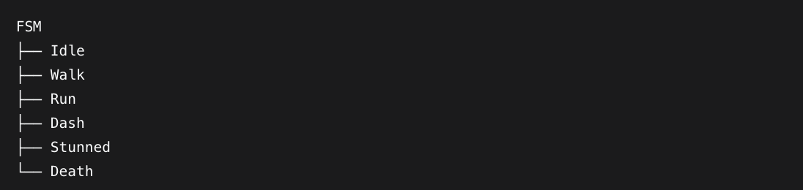
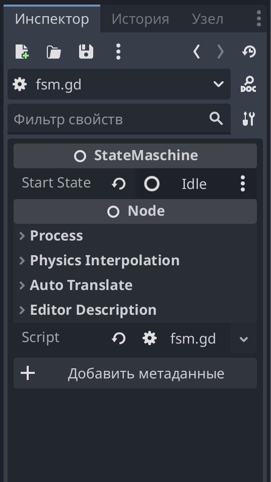
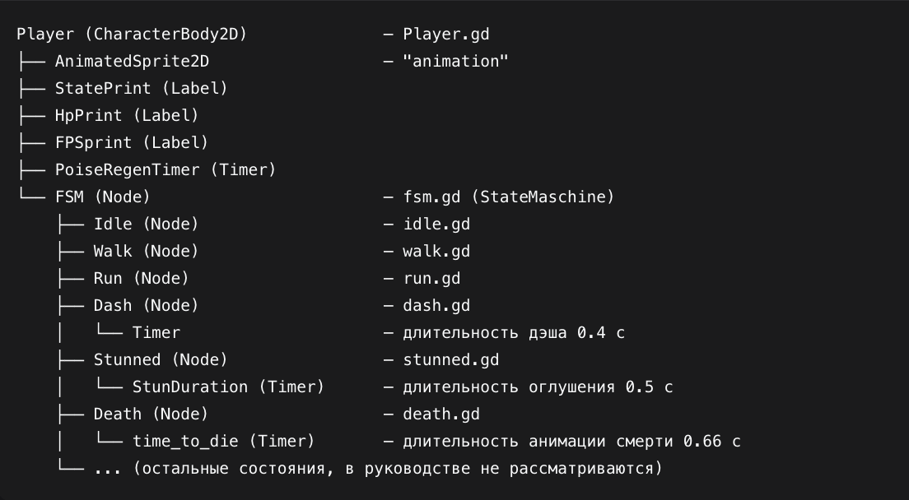
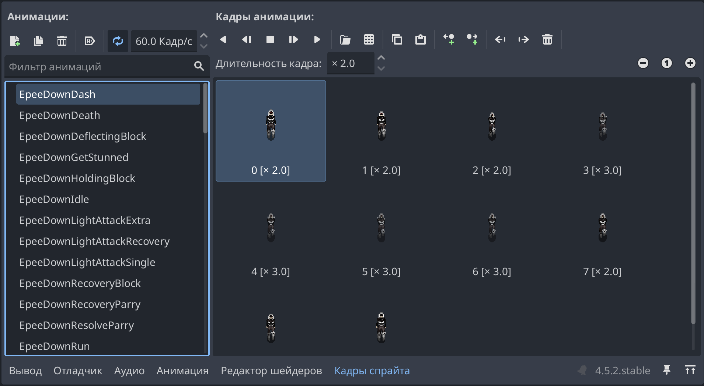

Руководство по FSM для персонажа в Godot 4.5
Дисциплина: Технология по выбору (разработка игр)
Тема: Реализация конечного автомата состояний (FSM) для персонажа в Godot 4.5
Движок: Godot 4.5
Язык: GDScript


1. Введение. Краткий обзор интерфейса Godot 4.5
Прежде чем перейти к конечному автомату, разберёмся с базовыми понятиями движка. Для новичка Godot может показаться перегруженным, но его структура логична и состоит из нескольких ключевых сущностей.

1.1. Сцены и узлы (Scene, Node)
В Godot всё есть узел (Node). Из узлов собираются сцены (Scene) — переиспользуемые блоки: персонаж, враг, уровень, элемент интерфейса.

Сцена — это дерево узлов, которое хранится в отдельном файле .tscn.

У каждого узла есть родитель и, при необходимости, дети.

Узлы могут быть разных типов: Node, Node2D, CharacterBody2D, Timer, Label, AnimatedSprite2D и сотни других.

Для нашего проекта ключевые типы узлов:

|Тип узла	|Роль|
|---|---|
|CharacterBody2D	|Корень персонажа (Player)|
|Node	|Родитель FSM и его состояний|
|AnimatedSprite2D	|Проигрывание анимаций персонажа|
|Timer	|Вспомогательные таймеры (дэш, оглушение, смерть)|
|Label	|Отладочный вывод на экран|


1.2. Основные панели редактора
Scene (Сцена) — слева, дерево узлов текущей сцены.

Inspector (Инспектор) — справа, свойства выбранного узла. Здесь отображаются переменные со @export.

FileSystem (Файловая система) — внизу слева, все файлы проекта.

Script (Редактор скриптов) — центральная вкладка, где пишется GDScript.

Output (Вывод) — внизу, print() и ошибки.

Node (Узлы) — внизу справа, список всех типов узлов для добавления.


1.3. Скрипты и жизненный цикл
Скрипт можно повесить на любой узел. У узла есть набор встроенных методов-«колбэков», которые движок вызывает автоматически:

|Метод	|Когда вызывается|
|---|---|
|_ready()	|Один раз, когда узел и все его дети попали в дерево сцены|
|_process(delta)	|Каждый кадр (отрисовка)|
|_physics_process(delta)	|Каждый физический тик (по умолчанию 60 раз в секунду)|
|_unhandled_input(event)	|При вводе, который не обработан UI|

1.4. Сигналы (Signals)
Сигналы — это встроенный механизм событий. Например, Timer отправляет сигнал timeout, когда завершится. Мы будем использовать таймеры для дэша, оглушения и смерти.

1.5. Экспорт переменных (@export)
Аннотация @export делает переменную видимой в инспекторе. Именно так мы будем задавать стартовое состояние FSM без правки кода.

gdscript
    @export var start_state: NodePath

Теперь, имея минимальное представление об интерфейсе, перейдём к предметной области.


2. Исследование предметной области

2.1. Проблема: разрастание логики персонажа
Когда персонаж умеет только ходить — всё просто. Но как только появляются бег, дэш, атаки, блок, парирование, оглушение и смерть, _physics_process превращается в «монстра» из вложенных if/elif. Такую логику тяжело:

- читать;
- расширять (добавление нового действия ломает старое);
- отлаживать (непонятно, в каком «режиме» сейчас персонаж).

2.2. Решение: конечный автомат состояний (FSM)
Конечный автомат (Finite State Machine, FSM) — это модель, в которой объект в любой момент времени находится ровно в одном из конечного набора состояний. Переключение между состояниями происходит по событиям (нажатие клавиш, истечение таймера, получение урона).

Каждое состояние:

- знает, как себя вести (что делать в _physics_process);
- знает, когда и куда перейти (по каким условиям вызвать change_to);
- имеет два пограничных метода — enter() (вошли в состояние) и exit() (вышли из состояния).

2.3. Сравнение подходов

|Подход	|Плюсы	|Минусы|
|---|---|
|if/elif |в _physics_process	Просто для 2–3 состояний	|Разрастается, сложно поддерживать|
|Enum + match	|Чуть чище, но логика всё ещё в одном файле	|Все состояния знают друг о друге|
|FSM на узлах (наш выбор)	|Каждое состояние — отдельный файл; легко добавлять и отлаживать	|Требует начальной настройки|

Мы выбрали FSM на узлах, потому что он:

- согласуется с философией Godot («всё есть узел»);
- использует встроенный жизненный цикл (_ready, _physics_process, _process);
- легко визуализируется в дереве сцены;
- позволяет использовать @export var start_state: NodePath для выбора стартового состояния прямо в инспекторе.


2.4. Архитектура нашего FSM
Система состоит из трёх уровней:

- Базовый класс State — определяет интерфейс состояния (enter, exit, inner_physics_process и т.д.).
- Промежуточный класс StatePlayer extends State — общий предок всех состояний игрока.
- Шесть конкретных состояний — Idle, Walk, Run, Dash, Stunned, Death.
- Управляет всем этим менеджер StateMaschine, висящий на узле FSM внутри Player.


2.5. Диаграмма переходов

В нашей игре шесть состояний игрока, между которыми возможны переходы:


2.6. Как это работает в Godot 4.5
FSM — обычный Node со скриптом fsm.gd.

- Состояния — дети FSM, каждое со своим скриптом, наследующим StatePlayer.
- FSM получает unhandled_input, _physics_process и _process от движка и передаёт их текущему состоянию через методы inner_*.
 - В _ready() FSM раздаёт всем детям ссылку на себя (child.state_machine = self).
 - Стартовое состояние задаётся через @export var start_state: NodePath и указывается в инспекторе.


 3. Техническое руководство для начинающих
Шаг 1. Создание проекта и персонажа
Открой Godot 4.5 → Create New Project → выбери папку → Create & Edit.

- В панели Scene нажми «+» (Add Child Node) → найди CharacterBody2D → создай.
- Переименуй узел в Player.
- Добавь ребёнком AnimatedSprite2D — к нему будет обращаться player.animation.
- Добавь ребёнком Node, переименуй в FSM.
- Сохрани сцену как player.tscn.


Шаг 2. Добавление состояний под FSM

Под узлом FSM создай шесть узлов типа Node и переименуй их:




Шаг 3. Базовый класс state.gd

Создай в файловой системе папку scripts/. В ней создай файл state.gd:

```
class_name State
extends Node

var state_machine = null

func inner_unhandled_input(_event: InputEvent) -> void:
	pass

func inner_physics_process(_delta: float) -> void:
	pass

func inner_process(_delta: float) -> void:
	pass

func enter() -> void:
	pass

func exit() -> void:
	pass
```
Разбор:

- class_name State — регистрирует глобальное имя класса.
- var state_machine = null — ссылка на менеджер; заполняется в _ready() FSM.
- Методы inner_* — «внутренние» обработчики, вызываемые FSM.
- enter() / exit() — пограничные методы.


Шаг 4. Промежуточный класс statePlayer.gd

Создай файл statePlayer.gd:

```
class_name StatePlayer
extends State

func _ready() -> void:
	pass
```
Зачем он нужен. Технически все состояния могли бы наследоваться от State. Но StatePlayer — удобное место для общей логики именно игрока. Сейчас он пуст, но при расширении сюда можно вынести общие ссылки и утилиты.


Шаг 5. Менеджер fsm.gd

Создай файл fsm.gd:
```
class_name StateMaschine
extends Node

@export var start_state: NodePath
@onready var state: State = get_node(start_state)

func _ready() -> void:
	for child in get_children():
		child.state_machine = self
	state.enter()

func unhandled_input(_event: InputEvent) -> void:
	state.inner_unhandled_input(_event)

func _physics_process(delta: float) -> void:
	state.inner_physics_process(delta)

func _process(delta: float) -> void:
	state.inner_process(delta)

func change_to(target_state: String) -> void:
	if not has_node(target_state):
		print("Нет такого " + target_state)
		return
	state.exit()
	state = get_node(target_state)
	state.enter()
```

Разбор:

- @export var start_state: NodePath — путь до стартового состояния, задаётся в инспекторе.
- @onready var state: State = get_node(start_state) — ссылка на стартовое состояние.
- _ready() — раздаёт детям state_machine = self и вызывает state.enter().
- unhandled_input, _physics_process, _process — проксируют вызовы в текущее состояние.
- change_to(target_state) — exit() у старого → смена ссылки → enter() у нового.




Шаг 6. Шесть состояний

Повесим скрипты на узлы Idle, Walk, Run, Dash, Stunned, Death.

Idle 
```
extends StatePlayer

@onready var player = get_node("../..")

func enter():
	player.InWeaponAction = false
	player.current_state = player.IdleState

func inner_physics_process(delta: float) -> void:
	if Input.is_action_pressed("forward_move") or Input.is_action_pressed("backward_move") \
	or Input.is_action_pressed("left_move") or Input.is_action_pressed("right_move"):
		player.state = "Walk"
		state_machine.change_to("Walk")

	if player.CurrentStamina < player.MaxStamina:
		player.CurrentStamina = min(
			player.CurrentStamina + player.StaminaRegen * player.StaminaRegenMultiplyer * delta,
			player.MaxStamina
		)

	if player.Poise < player.MaxPoise and player.PoiseRegenTimer.get_time_left() == 0:
		player.Poise = min(player.Poise + player.PoiseRegen * delta, player.MaxPoise)

	player.animation.play(player.weapon + player.direction + "Idle")

func take_damage(Damage, PD) -> void:
	player.HitPoints -= Damage
	player.Poise -= PD
	player.PoiseRegenTimer.start(3)
	if player.HitPoints <= 0:
		state_machine.change_to("Death")
	elif player.Poise <= 0:
		state_machine.change_to("Stunned")
```

Walk
```
extends StatePlayer

@onready var player = get_node("../..")

func enter():
	player.velocity = Vector2.ZERO
	player.InWeaponAction = false
	player.current_state = player.WalkState

func inner_physics_process(delta: float) -> void:
	if player.IsMoving == false:
		player.state = "Idle"
		state_machine.change_to("Idle")

	if Input.is_action_pressed("Run") and player.CurrentStamina >= player.MaxStamina * 0.15:
		player.state = "Run"
		state_machine.change_to("Run")

	if Input.is_action_just_pressed("Dash") and player.CurrentStamina >= player.DashStaminaCost:
		player.CurrentStamina -= player.DashStaminaCost
		player.state = "Dash"
		state_machine.change_to("Dash")

	if player.IsMoving:
		player.animation.play(player.weapon + player.direction + "Walk")
		player.Speed2 = player.Speed
	else:
		player.animation.stop()

	player.velocity = player.Speed2 * player.DirectionVect
	player.move_and_slide()

	if player.CurrentStamina < player.MaxStamina:
		player.CurrentStamina = min(player.CurrentStamina + player.StaminaRegen * delta, player.MaxStamina)

func take_damage(Damage, PD) -> void:
	player.HitPoints -= Damage
	player.Poise -= PD
	player.PoiseRegenTimer.start(3)
	if player.HitPoints <= 0:
		state_machine.change_to("Death")
	elif player.Poise <= 0:
		state_machine.change_to("Stunned")
```

Run 
```
extends StatePlayer

@onready var player = get_node("../..")

func enter():
	player.InWeaponAction = false
	player.current_state = player.RunState

func inner_physics_process(delta: float) -> void:
	if Input.is_action_just_pressed("Dash") and player.CurrentStamina >= player.DashStaminaCost:
		player.CurrentStamina -= player.DashStaminaCost
		player.state = "Dash"
		state_machine.change_to("Dash")

	if Input.is_action_pressed("Run") == false or player.CurrentStamina < 1:
		player.state = "Walk"
		state_machine.change_to("Walk")
	elif player.IsMoving == false:
		player.state = "Idle"
		state_machine.change_to("Idle")

	player.CurrentStamina -= player.RunStaminaCost * delta

func take_damage(Damage, PD) -> void:
	player.HitPoints -= Damage
	player.Poise -= PD
	player.PoiseRegenTimer.start(3)
	if player.HitPoints <= 0:
		state_machine.change_to("Death")
	elif player.Poise <= 0:
		state_machine.change_to("Stunned")
```

Dash 
```
extends StatePlayer

@onready var timer = get_node("./Timer")
@onready var player = get_node("../..")

func enter():
	if Input.is_action_pressed("forward_move"):
		player.DirectionVect = Vector2(0, -1)
	elif Input.is_action_pressed("backward_move"):
		player.DirectionVect = Vector2(0, 1)
	elif Input.is_action_pressed("left_move"):
		player.DirectionVect = Vector2(-1, 0)
	elif Input.is_action_pressed("right_move"):
		player.DirectionVect = Vector2(0, 1)
	timer.start(0.4)
	player.InWeaponAction = false
	player.current_state = player.DashState

func inner_physics_process(_delta: float) -> void:
	if timer.get_time_left() != 0:
		player.Speed2 = player.DashSpeed
		player.velocity = player.Speed2 * player.DirectionVect
		player.move_and_slide()
		player.animation.play(player.weapon + player.direction + "Dash")
	else:
		state_machine.change_to("Walk")
		player.state = "Walk"

func take_damage(Damage, PD) -> void:
	if timer.get_time_left() > 0.3 or timer.get_time_left() < 0.1:
		player.HitPoints -= Damage
		player.Poise -= PD
		player.PoiseRegenTimer.start(3)
		if player.HitPoints <= 0:
			state_machine.change_to("Death")
		elif player.Poise <= 0:
			state_machine.change_to("Stunned")
```

Stunned 
```
extends StatePlayer

@onready var StunCD = get_node("StunDuration")
@onready var player = get_node("../..")

func enter():
	StunCD.start(0.5)
	player.state = "Stunned"
	player.current_state = player.StunnedState

func inner_process(_delta: float) -> void:
	if StunCD.get_time_left() == 0:
		player.state = "Idle"
		state_machine.change_to("Idle")
	player.animation.play(player.weapon + player.direction + "GetStunned")

func exit():
	player.Poise = player.MaxPoise * 0.5

func take_damage(Damage) -> void:
	player.HitPoints -= Damage
	if player.HitPoints <= 0:
		state_machine.change_to("Death")
```

Death 
```
extends StatePlayer

@onready var time_to_die = get_node("time_to_die")
@onready var player = get_node("../..")

func enter():
	time_to_die.start(0.66)
	player.state = "Death"

func inner_process(_delta: float) -> void:
	if time_to_die.get_time_left() == 0:
		player.position = Vector2(740, 2550)
		player.state = "Idle"
		state_machine.change_to("Idle")

	player.animation.play(player.weapon + player.direction + "Death")

func exit():
	player.HitPoints = player.MaxHitPoints
	player.Poise = player.MaxPoise
	player.CurrentStamina = player.MaxStamina
	player.direction = "Left"
```


Шаг 7. Связка со скриптом Player.gd

Все состояния обращаются к переменным через player.<something>. Эти переменные живут в Player.gd. Минимально нужно объявить:

Player.gd 
```
class_name Player
extends CharacterBody2D

@onready var animation = $AnimatedSprite2D
@onready var PoiseRegenTimer = $PoiseRegenTimer

@onready var IdleState = get_node("FSM/Idle")
@onready var WalkState = get_node("FSM/Walk")
@onready var RunState = get_node("FSM/Run")
@onready var DashState = get_node("FSM/Dash")
@onready var StunnedState = get_node("FSM/Stunned")

var direction = "Forward"
var state = "Idle"
var current_state : Node
var weapon = "Epee"
var MaxHitPoints: int = 100
var HitPoints = MaxHitPoints
var MaxStamina: int = 100
var CurrentStamina = MaxStamina
var StaminaRegen = MaxStamina * 0.25
var StaminaRegenMultiplyer = 2
var DashStaminaCost = 30
var RunStaminaCost = 10
@export var MaxPoise = 50
var Poise = MaxPoise
@export var PoiseRegen = 10

@export var Speed = 350
var Speed2 = 0
@export var RunSpeed = 650
@export var DashSpeed = 1300
var IsMoving = false
var DirectionVect = Vector2(0, 0)
```


Шаг 8. Настройка сцены

Дерево узлов Player должно выглядеть так:



Шаг 9. Настройка имени анимаций
В коде анимация вызывается так: player.animation.play(player.weapon + player.direction + "Idle"). Значит, в AnimatedSprite2D должны быть SpriteFrames с именами:

- EpeeForwardIdle, EpeeForwardWalk, EpeeForwardRun, EpeeForwardDash, EpeeForwardGetStunned, EpeeForwardDeath;
- то же для Right, Down, Left.

Где Epee — это player.weapon, Forward — player.direction.




4. Заключение
В ходе работы была спроектирована и реализована конечная машина состояний (FSM) для игрового персонажа в Godot 4.5. Полученная система:

- разделяет поведение персонажа на шесть изолированных состояний — Idle, Walk, Run, Dash, Stunned, Death;
- использует два базовых класса (State и StatePlayer) и одного менеджера (StateMaschine);
- легко расширяется: чтобы добавить новое поведение, достаточно создать новый узел-Node со скриптом-наследником StatePlayer;
- настраивается без правки кода — стартовое состояние задаётся через @export var start_state: NodePath в инспекторе;
- отлично визуализируется прямо в дереве сцены Godot.


